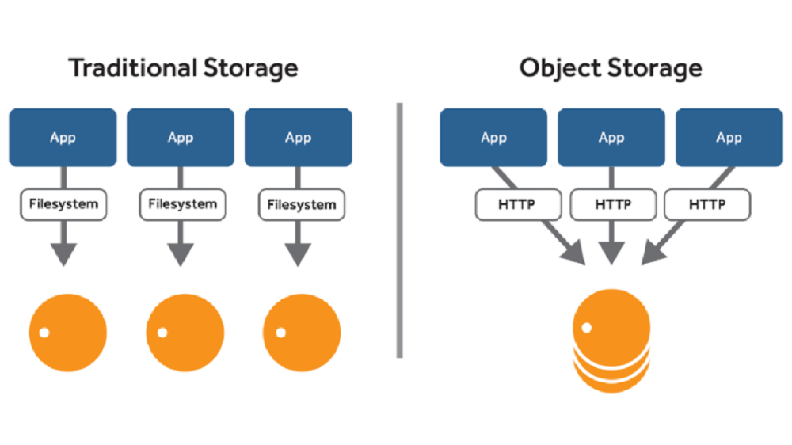

# Yandex Object Storage

[Yandex Object Storage](https://yandex.cloud/ru/docs/storage/) — сервис для хранения данных. HTTP API сервиса совместим с API Amazon S3

## S3 

[S3 или Simple Storage Service](https://yandex.cloud/ru/docs/glossary/s3) — общее название сервисов, где хранятся цифровые данные. 
Работает по одноименному протоколу, разработанному компанией Amazon для сервиса Amazon Simple Storage Service.



## Инструменты для работы с Yandex Object Storage

Весь список инструментов -- https://yandex.cloud/ru/docs/storage/tools/.

Пример. [Загрузка файла через curl](https://yandex.cloud/ru/docs/troubleshooting/storage/how-to/curl-api-request-example)

1. Создать сервисный аккаунт https://yandex.cloud/ru/docs/iam/operations/sa/create#console_1 с ролью storage.editor
2. Создать статический ключ https://yandex.cloud/ru/docs/iam/operations/authentication/manage-access-keys#create-access-key 
3. Загрузить файл
```bash
echo "hello mir" > file.txt

file='file.txt' ;\
bucket='devops-demo' ;\
resource="/${bucket}/${file}" ;\
contentType="text/plain" ;\
dateValue=`date -R` ;\
stringToSign="PUT\n\n${contentType}\n${dateValue}\n${resource}" ;\
s3Key='<ID статическго ключа>' ;\
s3Secret='Значение статическго ключа' ;\
signature=`echo -en ${stringToSign} | openssl sha1 -hmac ${s3Secret} -binary | base64` ;\
curl -vvv -X PUT -T "${file}" \
  -H "Host: ${bucket}.storage.yandexcloud.net" \
  -H "Date: ${dateValue}" \
  -H "Content-Type: ${contentType}" \
  -H "Authorization: AWS ${s3Key}:${signature}" \
  https://${bucket}.storage.yandexcloud.net/${file}
```

## Хостинг вебсайта в Yandex Object Storage

1. Создать бакет devops-demo-website
2. Загрузить index.html https://github.com/prafdin/devops-demo-website/blob/packer-demo/index.html
3. Сделать бакет публичным